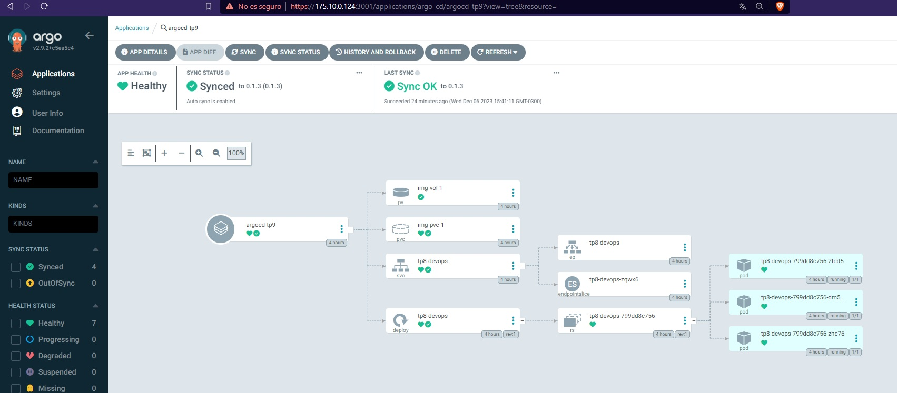

# Desafío núemro 9 - CI/CD y Kubernetes

## Introducción

En el presente desafío, vuelvo a utilizar el stack de Ubuntu Server nativo que utilicé para el desafío número 8.
En este stack tengo instalado minikube y configurado kubectl como herramienta de linea de comandos. Así, también, utilice el deployment que habia hecho para el anterior práctico, el cual despliega 3 replicas de una pagina web, su servicio NodePort, su Persistent Volume y su Persistent Volume Claim.

## Instalación de ArgoCD

Comencé instalando helm, tal como se mostraba en el repo de la clase 41, para luego instalar con helm Argo CD. 
Todo funcionó de la misma manera, a excepcion del comando kubectl para realizar el port forward del Argo CD server.
Por alguna razón este comando no exponía el puerto a pesar de ser un servicio NodePort.
Finalmente, utilizando la ip de mi nodo (llamado "minikube", el cual creé para el practico anterior), enruté el trafico entre esta ip con el puerto de ArgoCD server hacia el puerto 3001 de mi entorno (Ubuntu Server nativo),con el siguiente comando.

`sudo iptables -t nat -A PREROUTING -p tcp --dport 3001 -j DNAT --to-destination 192.168.49.2:31482`

Con esto, ya pude acceder al panel web de ArgoCD.

## Configuración del tag para el repo y Github Pages

En este punto no tuve demasiados problemas, cree el workflow de la misma manera que lo hicimos en clase y no hubo ningun problema. Se supone que la pagina de Github Pages es publica aunque el repositorio de donde proviene sea privado, pero en mi caso, ni siquiera podia hacer helm install. Luego cambie la visibilidad del repositorio a público y funcionó.

## Aplicación de Argo CD

En este último punto no tuve ningún problema, a excepción de que la aplicación no sincronizaba con el repositorio.
Busque muchas fuentes en internet pero nada resolvía mi problema. Pasado un tiempo, decidi fijarme si el entorno de minikube tenia acceso a internet para poder sincronizar el repositorio y no lo tenia. Luego de reiniciar Docker y minikube, pude tener conectividad y todo funcionó!

